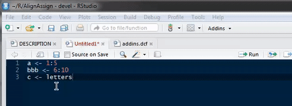

# AlignAssign

[](https://travis-ci.org/seasmith/AlignAssign)

Align the assignment operators (either `<-` or `=`) within a highlighted area.

Before:
```{r}
a <- 1:5
bbb <- 6:10
c <- letters
```

After:
```{r}
a   <- 1:5
bbb <- 6:10
c   <- letters
```



### What
AlignAssign contains two addins whose purpose is to align all of either the  `<-` or `=` assignment operators within a highlighted region. It does not "reflow" your code if the alignment breaks the page width. This addin also does not treat commented lines differently to uncommented lines. __If there is either one of the assignment operators within a highlighted comment line, then it will either align that operator or align other operators to it.__

### Install
`devtools::install_github("seasmith/AlignAssign")`

### Demos

#### Demo 1
When you highlight the following chunk of code (region) - whether you highlight the entirity or just a portion of the first and last lines - and then run the addin...
```{r}
# This is a commented line
# So is this
a <- 1:5
b <- 6:10
copy_a <- a
# More comments
```

...the result will look like this.
```{r}
# This is a commented line
# So is this
a      <- 1:5
b      <- 6:10
copy_a <- a
# More comments
```

#### Demo 2
The above example also works for the `=` operator (where it may be most useful when listing elements in a list). Before...
```{r}
# Perosnal information
list(surname = "Crichton",
     firstName = "John",
     address = NA,
     occupation = "fugitive")
```

...after.
```{r}
# Perosnal information
list(surname    = "Crichton",
     firstName  = "John",
     address    = NA,
     occupation = "fugitive")
```

#### Demo 3
Be mindful that highling a chunk of code which has assignment operators within commented lines, like the following, and running the addin...
```{r}
# This is a commented line with an assignment operator <-
a <- 1:5
b <- 6:10
c <- 11:15
# There is an assignment operator <- here, too
```

...will result in this.
```{r}
# This is a commented line with an assignment operator <-
a                                                      <- 1:5
b                                                      <- 6:10
c                                                      <- 11:15
# There is an assignment operator                      <- here, too
```

#### Demo 4
There is also no special handling of assignment operators within a function. So, if you highlighted the entire chunk below and then ran the addin...
```{r}
var1 <- letters
var2 <- as.list(sample(1:26, 26))
names(var2) <- var1[unlist(var2)]
list.pos <- function(name, lst){
    matches <- sapply(name, function(x){
        matched <- which(names(lst) %in% x)

        if(length(matched) == 0) matched <- NA
        matched
    })
    return(matches)
}
positions <- list.pos(c("a", "bbb", "c"), var2)
```

...the result would look like this.
```{r}
var1                                     <- letters
var2                                     <- as.list(sample(1:26, 26))
names(var2)                              <- var1[unlist(var2)]
list.pos                                 <- function(name, lst){
    matches                              <- sapply(name, function(x){
        matched                          <- which(names(lst) %in% x)

        if(length(matched) == 0) matched <- NA
        matched
    })
    return(matches)
}
positions                                <- list.pos(c("a", "bbb", "c"), var2)
```
